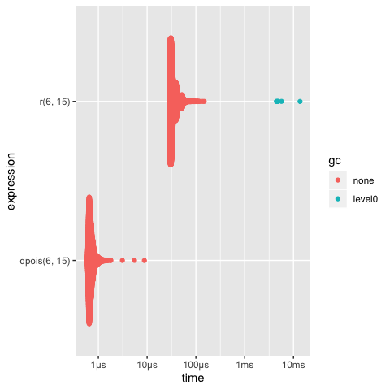
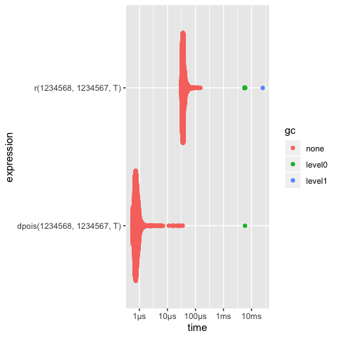
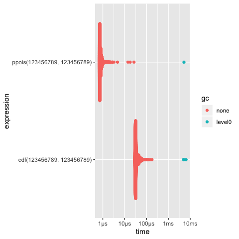
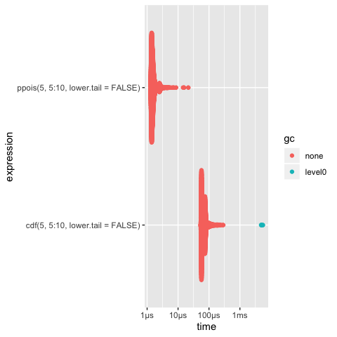

```{r setup, include = FALSE}
knitr::opts_chunk$set(
  collapse = TRUE,
  comment = "#>"
)
```

The CZPoisson R package is designed to replicate Catherine Loader's[^1] dpois implementation to calculate the approximate Poisson distribution.

[^1]: Loader, C. (2000). Fast and accurate computation of binomial probabilities. \newline
[https://lists.gnu.org/archive/html/octave-maintainers/2011-09/pdfK0uKOST642.pdf](https://lists.gnu.org/archive/html/octave-maintainers/2011-09/pdfK0uKOST642.pdf)

## Package Info

The repo for CZPoisson can be found:

[https://github.com/cynzajac/CZPoisson](https://github.com/cynzajac/CZPoisson)

CZPoisson containes two functions: 

1. Poisson probability mass function `r`
2. Poisson cumulative distribution function `cdf`

`r` takes two or three arguments:

* `x`    (required) -> count
* `lamb` (required) -> mean of distribution of counts
* `log`  (optional) -> returns the log of probabilities

`cdf` takes between two or four arguments:

* `x`          (required) -> count
* `lamb`       (required) -> mean of distribution of counts
* `lower.tail` (optional) -> returns the lower tail probabilities
* `log.p`      (optional) -> returns the log of probabilities


## Examples

The following is the complete example from the `CZPoisson` package

    > ## After installing CZPoisson
    > library(CZPoisson)
    
    > # Poisson probability mass function 'r'
    > r(6,15)
    [1] 0.00483947
    
    > #Check against dpois
    > dpois(6, 15)
    [1] 0.00483947
    
    > ## Calculating log probability of the poisson distribution 
    
    > r(1234568,1234567,T)
    [1] -7.932055
    > dpois(1234568,1234567,T)
    [1] -7.932055
    
    > # Poisson cumulative distribution function 'cdf'
    
    > cdf(123456789, 123456789)
    [1] 0.5000239
    > ppois(123456789, 123456789)
    [1] 0.5000239
    
    > # Calculating log probability for the upper tail 
    
    > cdf(5, 5:10, lower.tail = FALSE)
    [1] 0.3840393 0.5543204 0.6992917 0.8087639 0.8843095 0.9329140
    > ppois(5, 5:10, lower.tail = FALSE)
    [1] 0.3840393 0.5543204 0.6992917 0.8087639 0.8843095 0.9329140

    > # Comparing original CZPoisson against original 
    
    > ## use 'all.equal()'
    > all.equal(c(r(6,15), 
        r(1234568,1234567,T), 
        cdf(123456789,123456789), 
        cdf(5, 5:10, lower.tail = FALSE)), 
      c(dpois(6, 15),  
        dpois(1234568,1234567,T), 
        ppois(123456789, 123456789), 
        ppois(5, 5:10, lower.tail = FALSE)))
    [1] TRUE
    
    > #Benchmarking
    
    > ## Install packages for comparison visualization 
    > library(bench)
    > library(gmp)
    > library(ggbeeswarm)
    
    > # Load test cases for both: 'r' & 'cdf' functions
    > ## print(result);plot(result)
    
    > result1 = mark(r(6,15), dpois(6,15))
    > print(result1);plot(result1)
    # A tibble: 2 x 13
      expression       min  median `itr/sec` mem_alloc `gc/sec` n_itr
      <bch:expr>   <bch:t> <bch:t>     <dbl> <bch:byt>    <dbl> <int>
    1 r(6, 15)      28.2µs  32.4µs    28218.        0B     16.9  9994
    2 dpois(6, 15)   566ns   685ns  1390565.        0B      0   10000
    # … with 6 more variables: n_gc <dbl>, total_time <bch:tm>,
    #   result <list>, memory <list>, time <list>, gc <list>

    > result2 = mark(r(1234568,1234567,T), 
        dpois(1234568,1234567,T))
    > print(result2);plot(result2)
    # A tibble: 2 x 13
      expression                     min  median `itr/sec` mem_alloc
      <bch:expr>                 <bch:t> <bch:t>     <dbl> <bch:byt>
    1 r(1234568, 1234567, T)      30.7µs  36.4µs    26197.        0B
    2 dpois(1234568, 1234567, T)   557ns   766ns  1199370.        0B
    # … with 8 more variables: `gc/sec` <dbl>, n_itr <int>, n_gc <dbl>,
    #   total_time <bch:tm>, result <list>, memory <list>, time <list>,
    #   gc <list>    
    
    > result3 = mark(cdf(123456789,123456789), 
        ppois(123456789,123456789))
    > print(result3);plot(result3)
    # A tibble: 2 x 13
      expression                      min median `itr/sec` mem_alloc
      <bch:expr>                  <bch:t> <bch:>     <dbl> <bch:byt>
    1 cdf(123456789, 123456789)    28.8µs   32µs    28203.        0B
    2 ppois(123456789, 123456789)   698ns  766ns  1231749.        0B
    # … with 8 more variables: `gc/sec` <dbl>, n_itr <int>, n_gc <dbl>,
    #   total_time <bch:tm>, result <list>, memory <list>, time <list>,
    #   gc <list>
    
    > result4 = mark(cdf(5, 5:10, lower.tail = FALSE), 
        ppois(5, 5:10, lower.tail = FALSE))
    > print(result4);plot(result4)
    # A tibble: 2 x 13
      expression                             min  median `itr/sec`
      <bch:expr>                         <bch:t> <bch:t>     <dbl>
    1 cdf(5, 5:10, lower.tail = FALSE)   53.01µs 64.07µs    14489.
    2 ppois(5, 5:10, lower.tail = FALSE)  1.28µs  1.48µs   620517.
    # … with 9 more variables: mem_alloc <bch:byt>, `gc/sec` <dbl>,
    #   n_itr <int>, n_gc <dbl>, total_time <bch:tm>, result <list>,
    #   memory <list>, time <list>, gc <list>

\newpage

## Examples' Figures

\bigskip


\newpage

\newpage

\newpage

